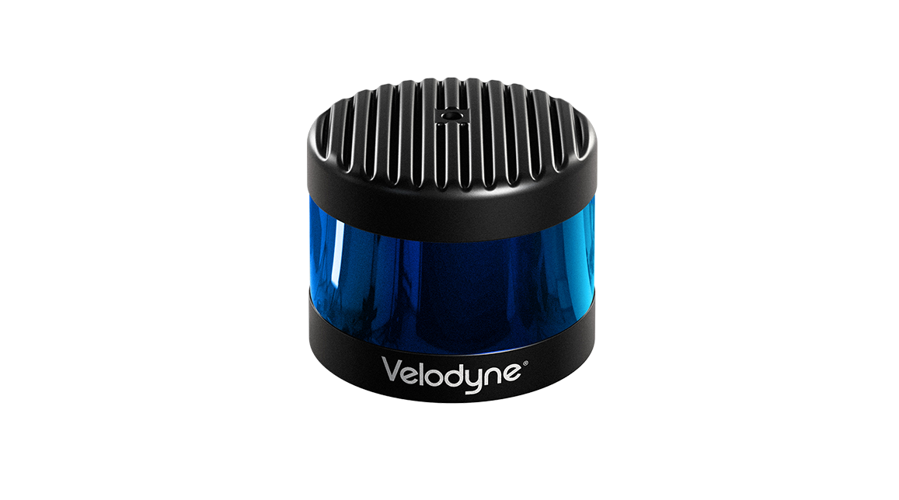
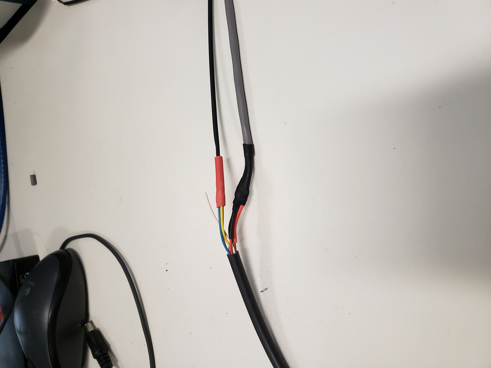
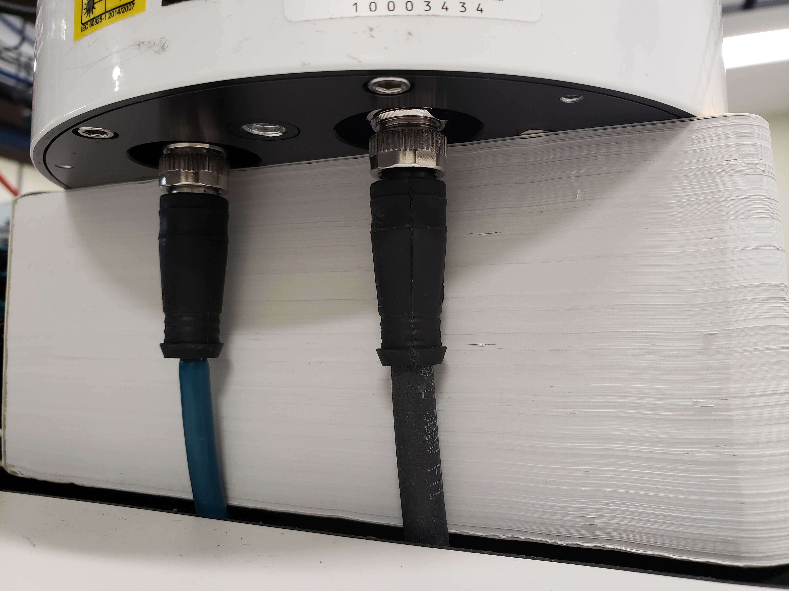

# Installation guide of Velodyne VLS-128

Apollo 3.5 uses the latest 128 line LiDAR system **VLS-128** from Velodyne LiDAR, Inc.



## Key Features:

- 360° Horizontal FOV
- +15° to -25° Vertical FOV
- Up to 300m Range
- Minimum Angular Resolution: 0.11°
- Up to 4 Return Modes
- Up to ~9.6 Million Points per Second
- Environmental Protection: IP67
- Connectors: RJ45 / M12
- High Volume, Automotive Grade Contract Pricing


## Mounting

A customized mounting structure is required to successfully mount an VLS-128 LiDAR on top of a vehicle. This structure must provide rigid support to the LiDAR system while raising the LiDAR to a certain height above the ground under driving conditions. This mounted height should prevent the laser beams from the LiDAR being blocked by the front and/or rear of the vehicle. The actual height needed for the LiDAR depends on the design of the vehicle and the mounting point of the LiDAR is relative to the vehicle being used. The LiDAR must be mounted straight without tilting. 
For a standard Lincoln MKZ, it is recommended that you mount the LiDAR at a minimum height of **1.8 meters** (from ground to the base of the LiDAR), to use the angle range for detection effectively.

```
If for some reason, the LiDAR beam has to be blocked by the vehicle, it might be necessary to apply a filter to remove these points while processing the data received.
```

## Wiring

Each VLS-128 LiDAR includes a cable bundle to connect the LiDAR to the power supply, and the GPS timesync source.



* **Connecting the LiDAR**

   Connect the power and signal cable to the matching ports on the LiDAR

   

## References

For additional information on Velodyne VLS-128, please refer to their 
[website here](https://velodynelidar.com/vls-128.html).

## Disclaimer

This device is `Apollo Platform Supported`
      
